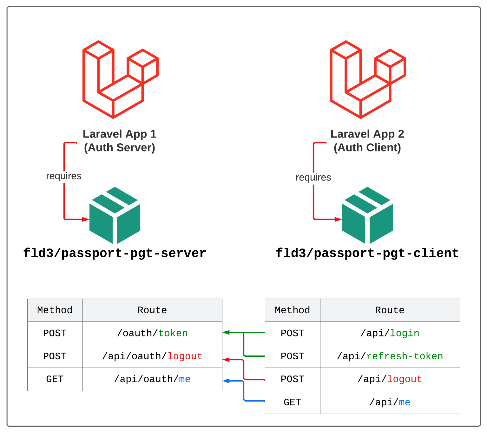
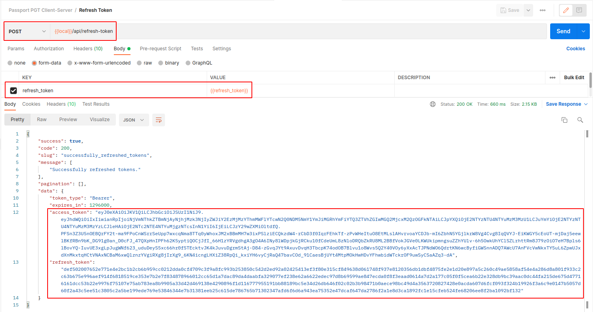

# Passport Password Grant Tokens (PGC) Client

**Laravel Passport** is an authentication package for Laravel. It is used by a lot of Laravel apps to authenticate users before accessing any resources. Basically, it generates an `access token` which you can then use on every request to provide identification to the `OAuth Server`.

One of Laravel Passport's mostly used authentication methods is the [`Password Grant Tokens`](https://laravel.com/docs/8.x/passport#password-grant-tokens) grant type. It is a stateless way to get `access tokens` and `refresh tokens` from the `OAuth Server`.

Take a look at [contributing.md](contributing.md) if you want to contribute to this project.



## Installation

**Note**: This is a private package hosted at Gitlab Composer Registry. Follow this [guide](https://git.fligno.com/marketplace/laravel-packages/fligno-toolkit/-/wikis/How-to-Install-a-Private-Package) to get authorization to install this package.

Via Composer

``` bash
$ composer require fld3/passport-pgt-client
```

## Setting Up

1. Add these variables to `.env` file if you want to override the default values.

| Variable Name      | Default Value       | Description                    |
|--------------------|---------------------|--------------------------------|
| `PPC_PASSPORT_URL` | `config('app.url')` | URL of Authentication Server   |
| `PPC_PGC_ID`       | null                | Password grant client's id     |
| `PPC_PGC_SECRET`   | null                | Password grant client's secret |

## Usage

### Passport PGT Client

The package provides a service called [**PassportPgtClient**](src/Services/PassportPgtClient.php) which you can use by calling its [helper functions](helpers/passport-pgt-client-helper.php):
1. `passportPgtClient()`
2. `passport_pgt_client()`

Here's the list of its available methods.

| Method Name                     | Return Type                                                           | Description                                                          |
|---------------------------------|-----------------------------------------------------------------------|----------------------------------------------------------------------|
| `getPassportUrl`                | `string`                                                              | gets the URL of Authentication Server                                |
| `getPasswordGrantClientId`      | `string or int or null`                                               | gets the Password Grant Client's id                                  |
| `getPasswordGrantClientSecret`  | `string or null`                                                      | gets the Password Grant Client's secret                              |
| `setAuthClientController`       | `string or null`                                                      | sets the `AuthClientController`                                      |
| `getAuthClientController`       | `string or null`                                                      | gets the `AuthClientController`                                      |
| `setLoginAuthController`        | `void`                                                                | sets the `LoginAuthController`                                       |
| `getLoginAuthController`        | `array`                                                               | gets the `LoginAuthController`                                       |
| `setRefreshTokenAuthController` | `void`                                                                | sets the `RefreshTokenAuthController`                                |
| `getRefreshTokenAuthController` | `array`                                                               | gets the `RefreshTokenAuthController`                                |
| `setLogoutAuthController`       | `void`                                                                | sets the `LogoutAuthController`                                      |
| `getLogoutAuthController`       | `array`                                                               | gets the `LogoutAuthController`                                      |
| `setMeAuthController`           | `void`                                                                | sets the `MeAuthController`                                          |
| `getMeAuthController`           | `array`                                                               | gets the `MeAuthController`                                          |
| `login`                         | `Fligno\ApiSdkKit\Models\AuditLog or Illuminate\Http\Client\Response` | sends POST request to Auth Server's `/oauth/token` to login          |
| `refreshToken`                  | `Fligno\ApiSdkKit\Models\AuditLog or Illuminate\Http\Client\Response` | sends POST request to Auth Server's `/oauth/token` to refresh tokens |
| `logout`                        | `Fligno\ApiSdkKit\Models\AuditLog or Illuminate\Http\Client\Response` | sends POST request to Auth Server's `/api/oauth/logout` to logout    |
| `getSelf`                       | `Fligno\ApiSdkKit\Models\AuditLog or Illuminate\Http\Client\Response` | sends GET request to Auth Server's `/api/oauth/me` to get user info  |

### Routes

Here's the list of routes that this package provides.

| Method | Route                | Description                                                                      |
|--------|----------------------|----------------------------------------------------------------------------------|
| POST   | `/api/login`         | This route sends POST request to Auth Server's `/oauth/token` to login.          |
| POST   | `/api/refresh-token` | This route sends POST request to Auth Server's `/oauth/token` to refresh tokens. |
| POST   | `/api/logout`        | This route sends POST request to Auth Server's `/api/oauth/logout` to logout.    |
| GET    | `/api/me`            | This route sends GET request to Auth Server's `/api/oauth/me` to get user info.  |

*Note*: If you wish to override the login, refresh token, logout, or get self logic, feel free to do so by using these methods from `PassportPgtClient` class:
- `setAuthClientController()`
- `setLoginAuthController()`
- `setRefreshTokenAuthController()`
- `setLogoutAuthController()`
- `setMeAuthController()`

### Examples

- Logging in a user


- Refreshing tokens



- Getting user's information based on access token


- Logging out a user


## Change log

Please see the [changelog](changelog.md) for more information on what has changed recently.

## Testing

``` bash
$ composer test
```

## Contributing

Please see [contributing.md](contributing.md) for details and a todolist.

## Security

If you discover any security related issues, please email jamescarlo.luchavez@fligno.com instead of using the issue tracker.

## Credits

- [James Carlo Luchavez][link-author]
- [All Contributors][link-contributors]

## License

MIT. Please see the [license file](license.md) for more information.

[ico-version]: https://img.shields.io/packagist/v/fld3/passport-pgt-client.svg?style=flat-square
[ico-downloads]: https://img.shields.io/packagist/dt/fld3/passport-pgt-client.svg?style=flat-square
[ico-travis]: https://img.shields.io/travis/fld3/passport-pgt-client/master.svg?style=flat-square
[ico-styleci]: https://styleci.io/repos/12345678/shield

[link-packagist]: https://packagist.org/packages/fld3/passport-pgt-client
[link-downloads]: https://packagist.org/packages/fld3/passport-pgt-client
[link-travis]: https://travis-ci.org/fld3/passport-pgt-client
[link-styleci]: https://styleci.io/repos/12345678
[link-author]: https://github.com/fld3
[link-contributors]: ../../contributors
